# Heart Disease Risk Prediction — End-to-End MLOps Pipeline

**MLOps Assignment 01 (AIMLCZG523)** — a reproducible, cloud-ready machine-learning
solution that predicts the risk of heart disease from patient health data and
serves it as a monitored REST API.

> Dataset: [Heart Disease UCI (Cleveland)](https://archive.ics.uci.edu/dataset/45/heart+disease) — 303 records, 13 features, binary target.

---

## Table of Contents
1. [Architecture](#architecture)
2. [Project structure](#project-structure)
3. [Quick start](#quick-start)
4. [Pipeline stages](#pipeline-stages)
5. [Results](#results)
6. [API usage](#api-usage)
7. [Docker, Kubernetes, CI/CD & Monitoring](#docker-kubernetes-cicd--monitoring)
8. [Reproducibility](#reproducibility)

---

## Architecture

```
                ┌─────────────────┐
                │  UCI Repository │
                └────────┬────────┘
                         │ download_data.py
                         ▼
   ┌──────────────────────────────────────────┐
   │  Data + EDA (clean, impute, visualize)    │
   └───────────────────┬──────────────────────┘
                        ▼
   ┌──────────────────────────────────────────┐
   │  Preprocessing Pipeline (ColumnTransformer)│
   │  + Train LR / RandomForest / XGBoost       │
   │  GridSearchCV, 5-fold CV                    │
   └───────┬───────────────────────┬───────────┘
           │ log params/metrics     │ best model
           ▼ /plots/model           ▼ joblib
   ┌───────────────┐        ┌──────────────────┐
   │    MLflow     │        │  models/*.joblib │
   └───────────────┘        └────────┬─────────┘
                                     ▼
                        ┌───────────────────────┐
                        │  FastAPI  /predict     │
                        │  /health  /metrics     │
                        └───────┬───────┬────────┘
                                │       │ Prometheus scrape
                     Docker img │       ▼
                                ▼   ┌───────────┐   ┌──────────┐
                        ┌────────────┐│Prometheus │──▶│ Grafana │
                        │ Kubernetes ││           │   │dashboard│
                        │ (Minikube) │└───────────┘   └──────────┘
                        │ LoadBalancer│
                        └────────────┘
                                ▲
                                │ CI/CD (GitHub Actions):
                                │ lint → train → test → build
```

A high-resolution version is in `screenshots/architecture.png`.

---

## Project structure

```
heart-disease-mlops/
├── data/
│   ├── download_data.py            # fetch + clean UCI dataset
│   └── heart_disease_clean.csv     # cleaned dataset (generated)
├── notebooks/
│   ├── 01_eda.ipynb                # EDA with visualizations (executed)
│   └── figures/                    # saved EDA plots (PNG)
├── src/
│   ├── config.py                   # paths, feature groups, constants
│   ├── data_preprocessing.py       # load + ColumnTransformer pipeline
│   ├── train.py                    # train LR/RF/XGB, tune, MLflow, save best
│   ├── evaluate.py                 # metrics + ROC/confusion-matrix plots
│   └── predict.py                  # inference helper
├── api/
│   └── main.py                     # FastAPI app (/predict, /health, /metrics)
├── models/                         # model.joblib + model_metadata.json (generated)
├── tests/                          # pytest unit + integration tests
├── monitoring/                     # prometheus.yml + grafana dashboards
├── k8s/                            # deployment.yaml, service.yaml, Helm chart
├── .github/workflows/ci.yml        # CI/CD pipeline
├── Dockerfile / .dockerignore
├── docker-compose.yml              # API + Prometheus + Grafana
├── requirements.txt / requirements-api.txt
├── README.md
├── report/                         # final written report
```

---

## Quick start

```bash
# 1. Create & activate a virtual environment
python3 -m venv venv
source venv/bin/activate

# 2. Install dependencies
pip3 install -r requirements.txt

# 3. Download + clean the dataset
python3 data/download_data.py

# 4. Train models (logs to MLflow, saves best model to models/)
python3 -m src.train

# 5. Run the tests
pytest -v

# 6. Serve the API
uvicorn api.main:app --reload --port 8000
# open http://localhost:8000/docs
```

---

## Pipeline stages Detailed Breakdown

### 1. Data Acquisition + EDA
- **Script:** `python data/download_data.py` and `notebooks/01_eda.ipynb`
- **Description:** The dataset (UCI Heart Disease) is downloaded automatically. We analyze missing values (imputed later in the pipeline) and feature distributions. A correlation heatmap identifies strong associations with the target variable, specifically highlighting max heart rate (`thalach`) and ST-depression (`oldpeak`).
- **Pipeline Run Details:** 
  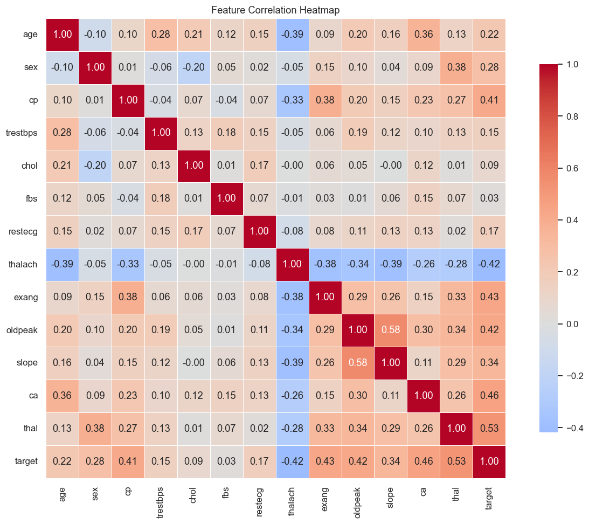
  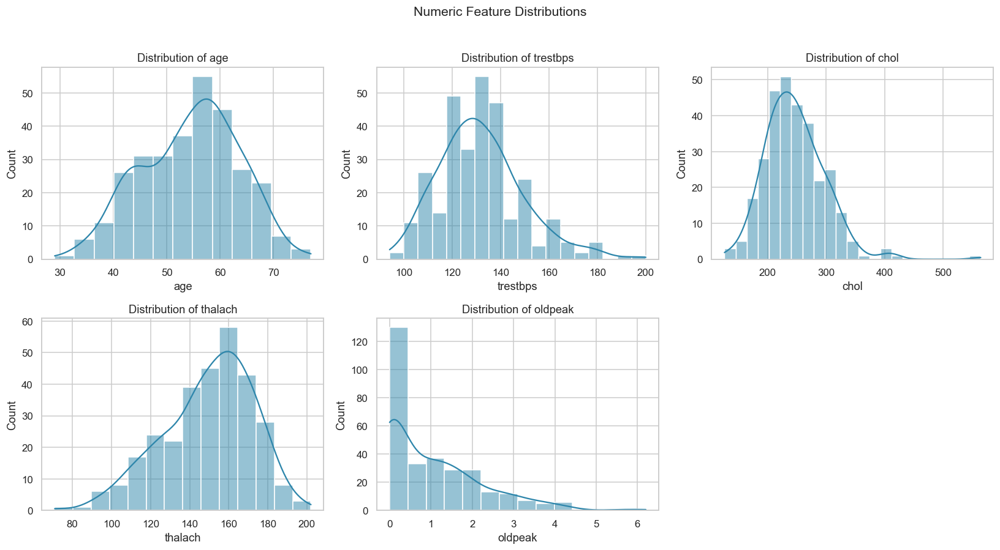

### 2. Feature Engineering & Modelling
- **Script:** `python -m src.train`
- **Description:** All transformations are wrapped in a scikit-learn `ColumnTransformer`. Numeric features get median imputation and `StandardScaler`; categorical features get most-frequent imputation and `OneHotEncoder`. We trained Logistic Regression, Random Forest, and XGBoost using `GridSearchCV` (5-fold CV). Logistic Regression was selected as the best model (Highest Test ROC-AUC of 0.965).
- **Pipeline Run Details:** 
  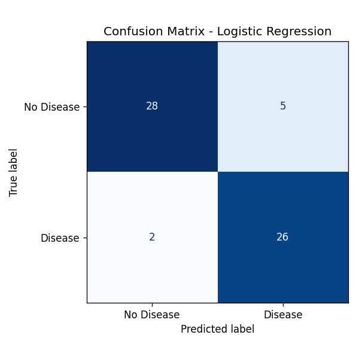
  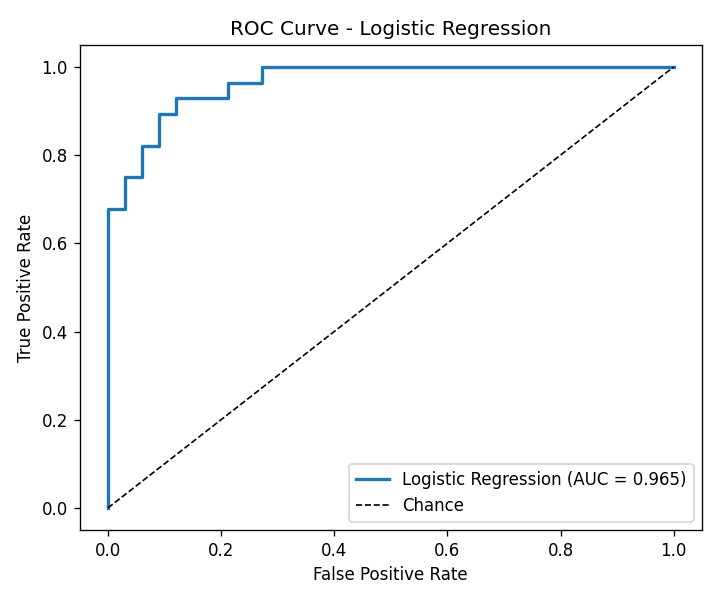

### 3. Experiment Tracking (MLflow)
- **Script:** `mlflow ui --backend-store-uri sqlite:///mlflow.db`
- **Description:** Every training run is logged to MLflow with a SQLite backend. Hyperparameters, metrics (Accuracy, Precision, Recall, F1, ROC-AUC), and visual plots (ROC curve, confusion matrix) are logged alongside the serialized model artifact.
- **Pipeline Run Details:** 
  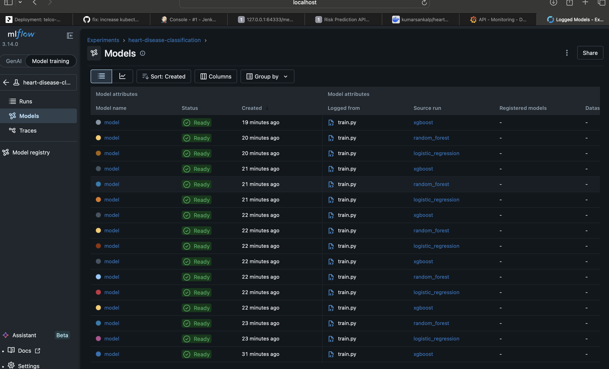
  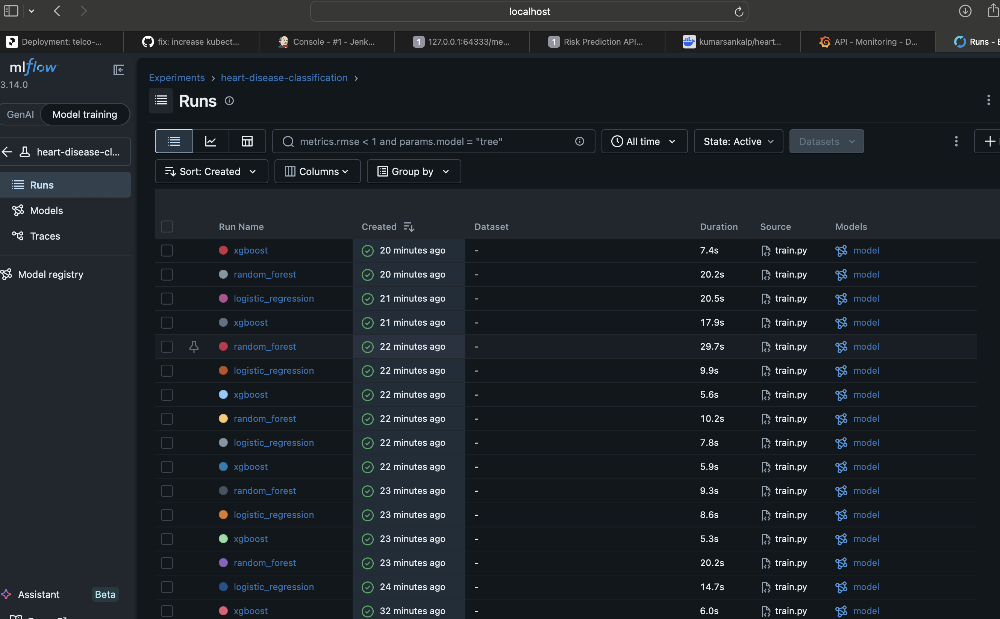
  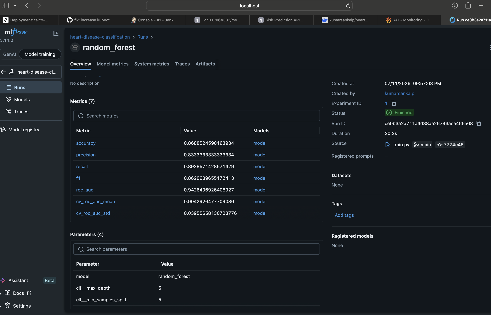
  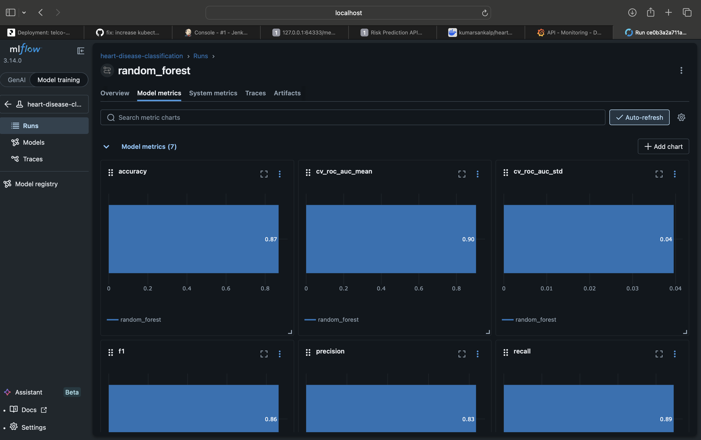

### 4. Packaging & Reproducibility
- **Description:** The entire `Pipeline` (preprocessing + classifier) is serialized as a single `model.joblib` artifact. This ensures that the exact same imputation and scaling logic used in training is automatically applied during API inference without manual data wrangling. Dependencies are strictly pinned in `requirements.txt`.
- **Pipeline Run Details:** 
  

### 5. CI/CD + Tests
- **Script:** `.github/workflows/ci.yml`, `pytest`
- **Description:** An automated GitHub Actions pipeline runs on every push. It executes `flake8` for linting, downloads the dataset, trains the model, runs a comprehensive 15-test `pytest` suite, and then builds and pushes the Docker image to Docker Hub. A separate CD workflow deploys it locally.
- **Pipeline Run Details:** 
  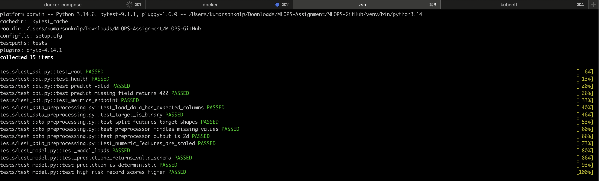
  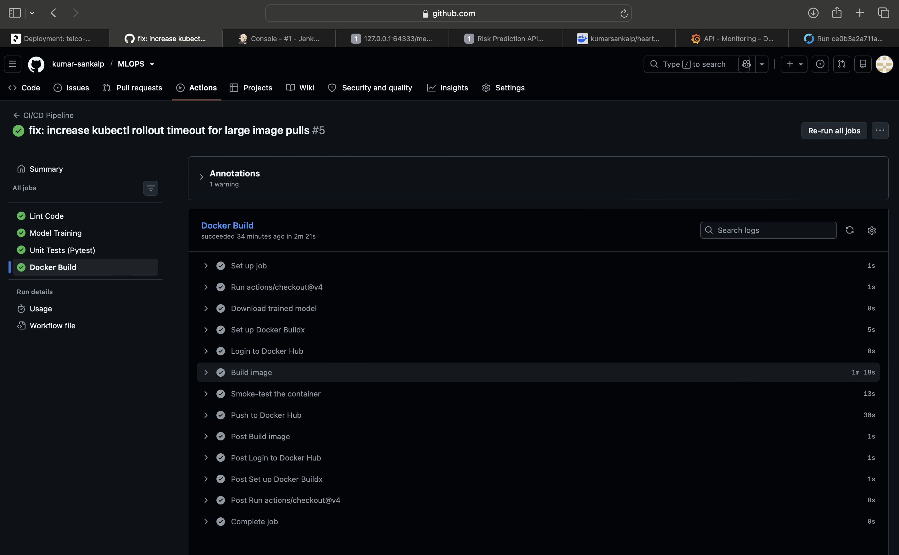
  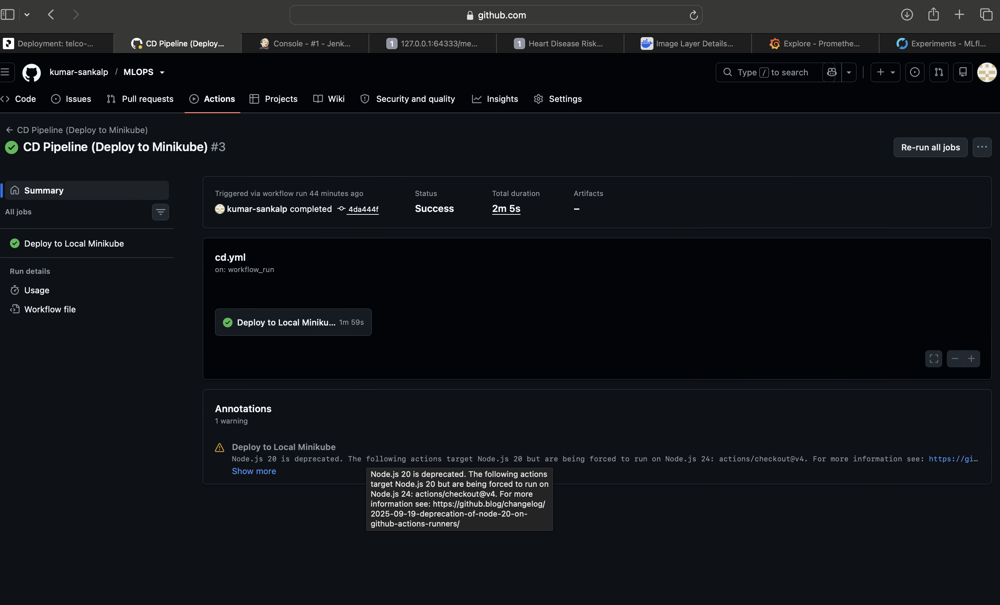

### 6. Containerization
- **Script:** `Dockerfile`, `docker build`
- **Description:** The FastAPI application is containerized using a slim `python:3.12-slim` base image. It runs securely as a non-root user and defines a Docker `HEALTHCHECK`. This guarantees that the API serving environment is completely identical regardless of where it is deployed.
- **Pipeline Run Details:** 
  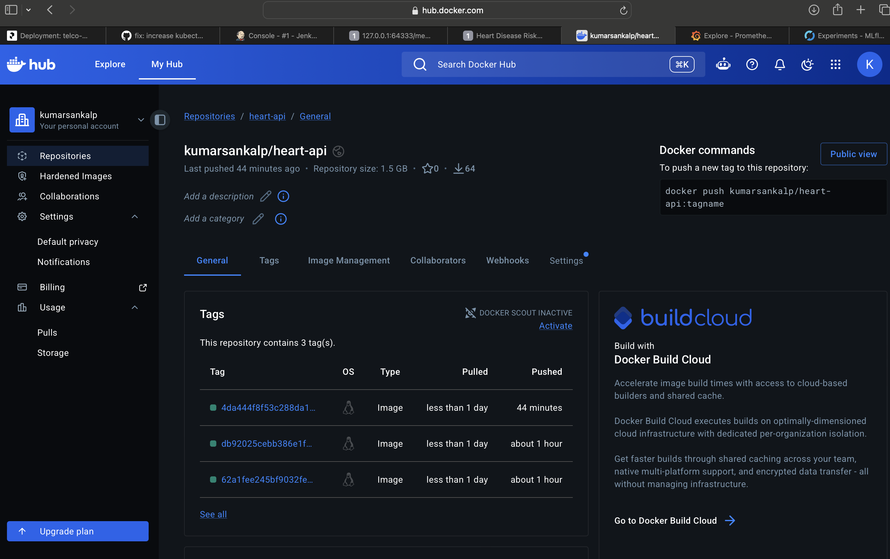

---

## Results

Models trained with 5-fold cross-validated `GridSearchCV` (scoring = ROC-AUC),
evaluated on a stratified 20% hold-out test set.

| Model | Accuracy | Precision | Recall | F1 | ROC-AUC | CV ROC-AUC |
|-------|:--------:|:---------:|:------:|:--:|:-------:|:----------:|
| **Logistic Regression** ⭐ | 0.885 | 0.839 | 0.929 | 0.881 | **0.965** | 0.898 |
| Random Forest | 0.852 | 0.828 | 0.857 | 0.842 | 0.947 | 0.904 |
| XGBoost | 0.885 | 0.862 | 0.893 | 0.877 | 0.949 | 0.882 |

⭐ **Logistic Regression** was selected as the production model (highest test ROC-AUC).
High recall (0.93) is desirable for a screening use-case — we prefer to catch
true positives even at the cost of some false positives.

---

## API usage

**Request:**
```bash
curl -X POST http://localhost:8000/predict \
  -H "Content-Type: application/json" \
  -d '{"age":63,"sex":1,"cp":3,"trestbps":145,"chol":233,"fbs":1,"restecg":0,"thalach":150,"exang":0,"oldpeak":2.3,"slope":0,"ca":0,"thal":1}'
```

**Response:**
```json
{ "prediction": 0, "label": "No Heart Disease", "probability": 0.3518 }
```

Endpoints: `GET /` · `GET /health` · `POST /predict` · `GET /metrics` · `GET /docs` (Swagger UI).

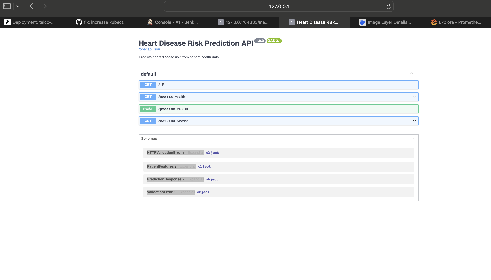

---

## Docker, Kubernetes, CI/CD & Monitoring

The CI/CD pipeline (`.github/workflows/ci.yml` and `cd.yml`) automates testing, containerization, and deployment. Upon pushing to `main`:
1. **CI**: Lints code, trains the model, runs tests, and builds/pushes a Docker image to Docker Hub tagged with the Git commit SHA.
2. **CD**: Triggers a self-hosted runner on the local machine to pull the new image and deploy it directly to the local Minikube cluster.

Alternatively, you can run these steps manually:

```bash
# Docker
docker build -t heart-api:1.0.0 .
docker run -p 8000:8000 heart-api:1.0.0

# Local monitoring stack (API + Prometheus + Grafana)
docker compose up --build

# Kubernetes (Minikube)
minikube start
kubectl apply -f k8s/deployment.yaml -f k8s/service.yaml
minikube service heart-api-service --url
```

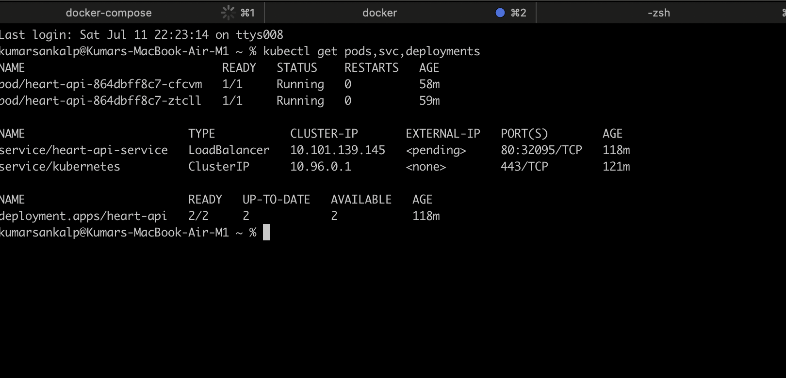
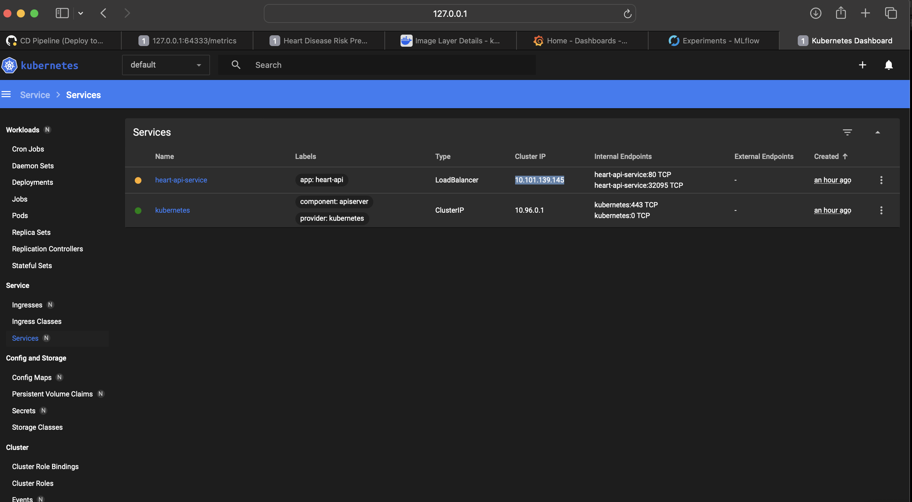
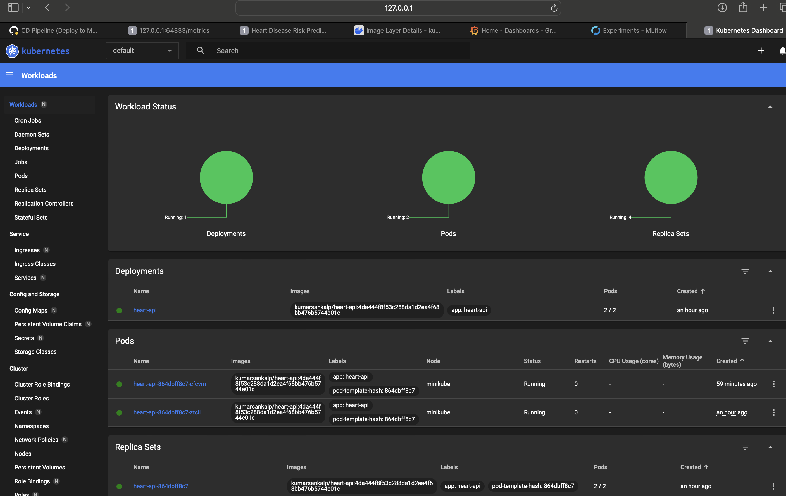
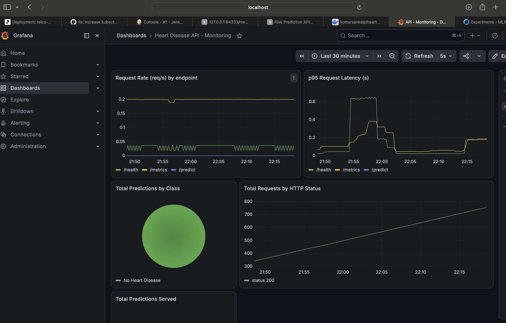

---

## Reproducibility

- **Fixed random seed** (`RANDOM_STATE = 42`) throughout training/splitting.
- **Pinned dependencies** in `requirements.txt`.
- **Full preprocessing baked into the saved pipeline** — inference applies the
  exact same imputation/scaling/encoding as training (`ColumnTransformer`).
- **MLflow** records every run's params, metrics, plots and model.
- **Docker** guarantees the serving environment is identical everywhere.

---

*See the `report/` directory for the detailed written report.*
